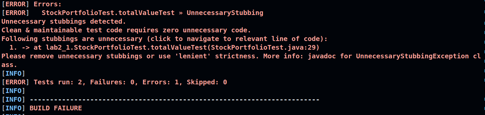
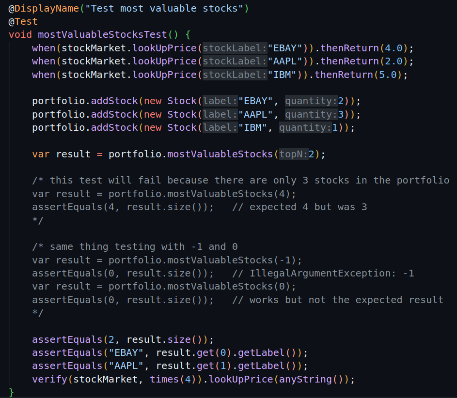

### 2.1 C

Mockito doesn't like when we have Unnecessary stubbings (expectations that aren't used) and the test fails. 

### 2.1 F

AI implementation works but it doesn't cover the edge cases like top 0, top -1 or top 5 when we only have 4 stocks. In the image bellow, you can see the commented tests and the results.

### 2.2 B

Mocking replaces the real HTTP client, preventing real API calls. A predefined JSON response simulates an API response, so that we can validate the JSON Deserialization.

### 2.3 F

#### mvn test

This command runs only unit tests using the Surefire Plugin (which is the default test runner in Maven).

#### mvn package

Does the same as the command above but if all tests pass, it packages the application (creates a JAR or WAR file).

#### mvn package -DskipTests=true

Skips all tests and builds the package.

#### mvn failsafe:integration-test

Runs integration tests (tests managed by the Failsafe Plugin) but it doesn't run unit tests.

#### mvn install

Runs unit tests, packages the application and installs the built artifact into the local Maven repository, making it available for other local Maven projects. It doesn't run integration tests.