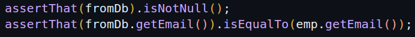
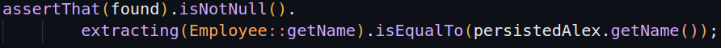
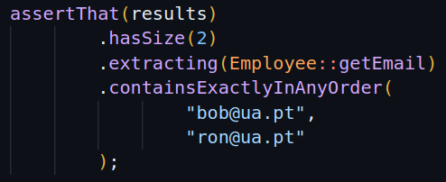
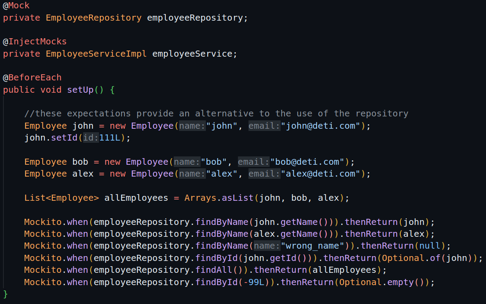

## a) Identify a couple of examples that use AssertJ expressive methods chaining.





## b) Take note of transitive annotations included in @DataJpaTest.

```
@Target(ElementType.TYPE)
@Retention(RetentionPolicy.RUNTIME)
@Documented
@Inherited
@BootstrapWith(DataJpaTestContextBootstrapper.class)
@ExtendWith(SpringExtension.class)
@OverrideAutoConfiguration(enabled = false)
@TypeExcludeFilters(DataJpaTypeExcludeFilter.class)
@Transactional
@AutoConfigureCache
@AutoConfigureDataJpa
@AutoConfigureTestDatabase
@AutoConfigureTestEntityManager
@ImportAutoConfiguration
```

## c) Identify an example in which you mock the behavior of the repository (and avoid involving a database).



## d) What is the difference between standard @Mock and @MockBean?

The **@Mock** is used to create a mock object within a test class (Mockito library) and run unit tests.
The **@MockBean** is used to mock objects in the Spring application context. It replaces the a specific bean for a mock one in the application context.

## e) What is the role of the file “application-integrationtest.properties”? In which conditions will it be used?

The file is used to configure the application properties for integration tests. When we run integration tests, it overrides the properties defined in the application.properties.

## f) the sample project demonstrates three test strategies to assess an API (C, D and E) developed with SpringBoot. Which are the main/key differences?

The C is a unit tests that mocks the repository.
The D is a integration test that mocks the web enviroment and conection.
The E is a integration test that uses the real implementation of the components (no mocks used).