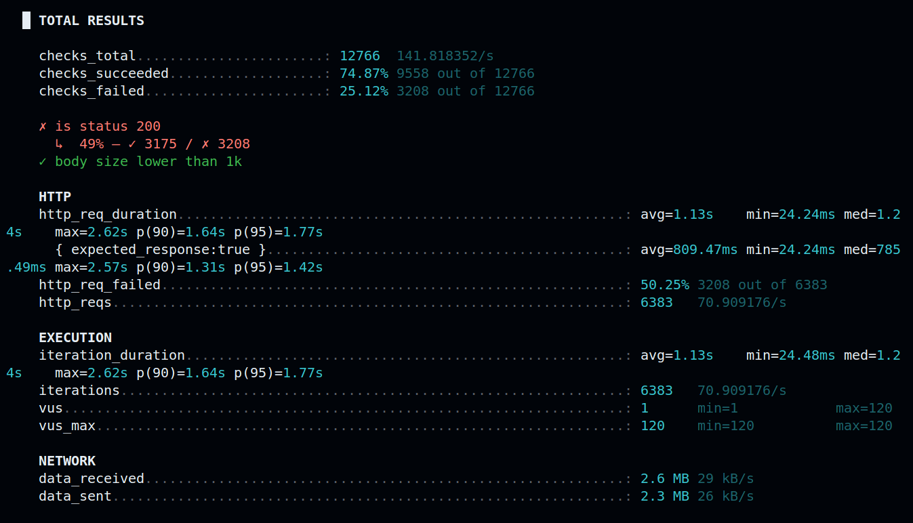
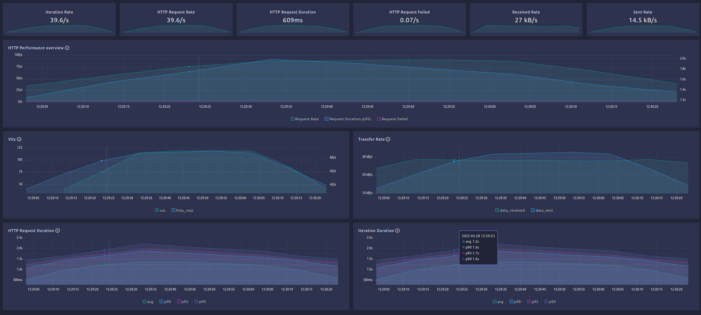
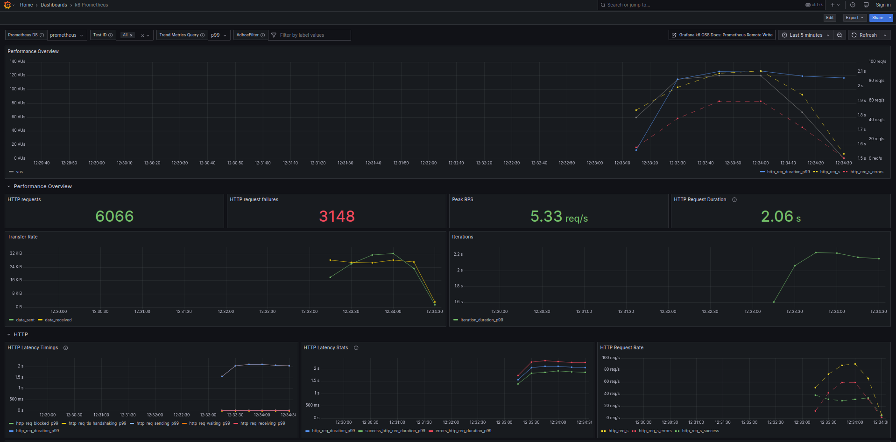
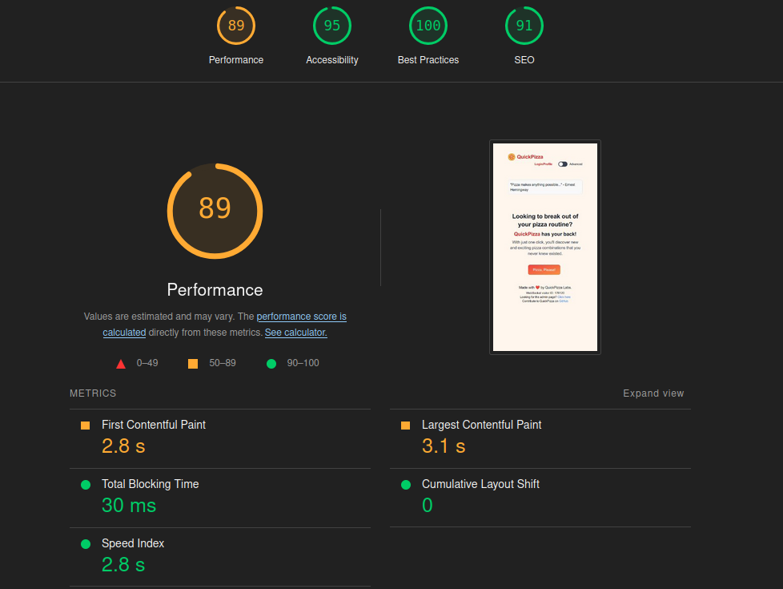
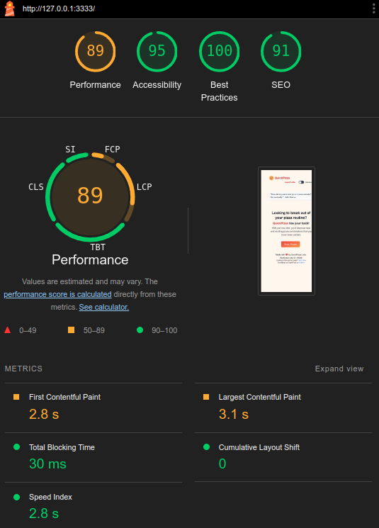
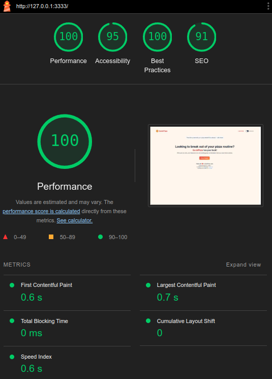
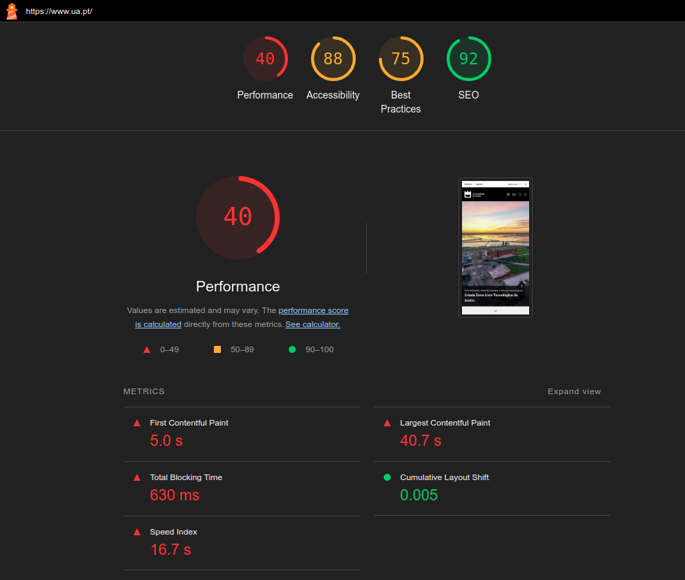
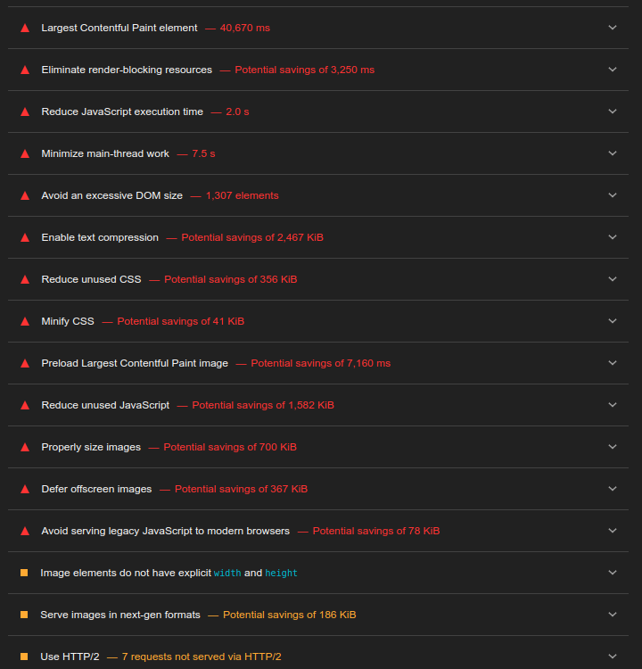

## 7.1 D 

How long did the API call take - 19.74ms

How many requests were made - 1

How many requests failed - 0

## 7.2 A

How long did the API calls take
- avg - 168.69ms
- min - 5.17ms
- max - 697.22ms

How many requests were made - 1802

How many requests failed - 0

## 7.2 F

## 7.2 G

## 7.3 B

## 7.3 C

**First contentful paint** is the time between the user's first navigation to the page (without cache, cookies, etc) until the content of the page is rendered

**Largest Contentful Paint** is the time taken during the page load when the "primary" content (presumably the html page, images that you can see, etc) has loaded and is visible

I would increase the contrast between the letters and the background, to improve accessibility

## 7.3 D

The results are the same. Using incognito tab guarantees that pluggins, cache or cookies do not influence the result

## 7.3 E

The results are not the same. The difference is due to desktops having more processing power than mobiles.

## 7.3 F

Different aspects (performance, accessibility, best practices, and SEO) worth testing beacuse:
- **Performance**: Faster websites improve user satisfaction and engagement while reducing bounce rates. Slow load times can frustrate users and negatively impact conversions.
- **Accessibility**: Ensuring a website is accessible allows users with disabilities to navigate and interact with the content.
- **Best Practices**: Following best practices ensures security, maintainability, and usability.
- **SEO**: Good SEO practices help a website rank higher in search results, increasing visibility and traffic.

By testing these aspects, developers create web applications that are fast, accessible, reliable, and discoverable, ultimately improving the overall user experience and business success.

## 7.3 G

This suggestions are useful to increase the overall user experience on the website. This problems could have been avoided if more tests like this one were made during the development process.