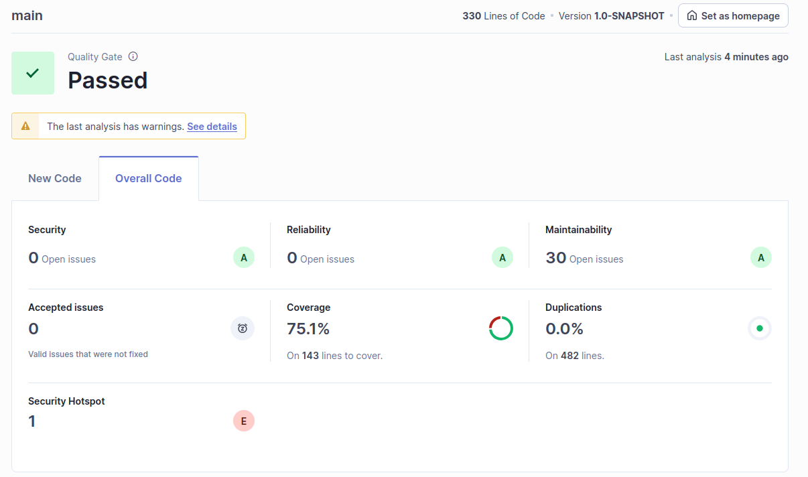
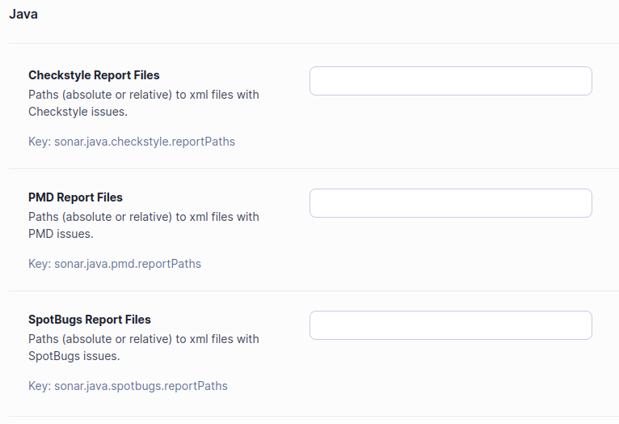

## Ex 8_1

The project passed the defined quality gate, that has the following conditions:

- New code has 0 issues.
- All new security hotspots are reviewed.
- New code is sufficiently covered by test.
- New code has limited duplication.

| Issue | Problem Description | How to solve |
| :---: | :---: | :---: |
| Security | 0 issues | N/A |
| Reliability | 0 issues | N/A |
| Maintainability | - Invoke method(s) only conditionally. | Specifically, the built-in string formatting should be used instead of string concatenation, and if the message is the result of a method call, then Preconditions should be skipped altogether, and the relevant exception should be conditionally thrown instead.
| Maintainability | - Remove this unused import 'java.security.SecureRandom'. | While it’s not difficult to remove these unneeded lines manually, modern code editors support the removal of every unnecessary import with a single click from every file of the project.
| Security hotspot | - Make sure that using this pseudorandom number generator is safe here. | Use a cryptographically secure pseudo random number generator (CSPRNG) like "java.security.SecureRandom" in place of a non-cryptographic PRNG. |

## 8_1 H

They are tools that enforce coding rules

